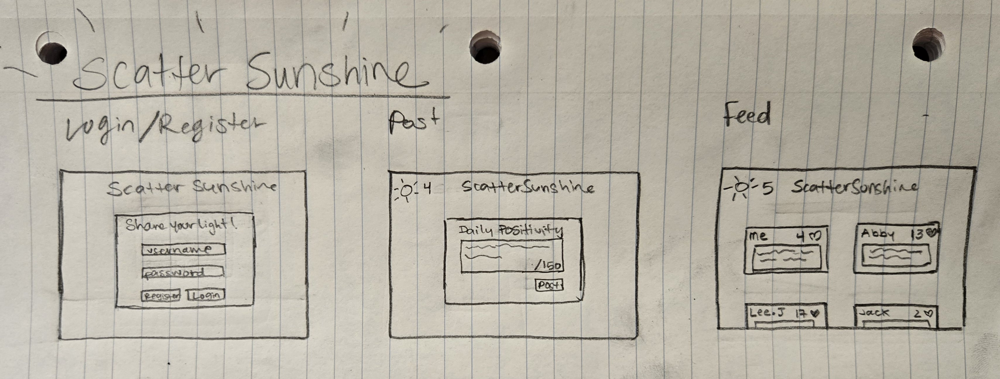

# Scatter Sunshine: A Community for Daily Positivity

[My Notes](notes.md)

Scatter Sunshine is a daily reflection platform inspired by the beloved hymn “There Is Sunshine in My Soul Today,” encouraging short, uplifting posts in a warm, faith-centered atmosphere. Each new post unlocks a real-time community feed with instant heart reactions, while a sun icon tracks your streak. Entries automatically expire at the day’s end for a fresh start every morning. 

## 🚀 Specification Deliverable

For this deliverable, I did the following. I checked the box `[x]` and added a description for things I completed.

- [x] Proper use of Markdown
- [x] A concise and compelling elevator pitch
- [x] Description of key features
- [x] Description of how you will use each technology
- [x] One or more rough sketches of your application. Images must be embedded in this file using Markdown image references.

### Elevator pitch

Scatter Sunshine is an innovative twist on daily positivity, blending spiritual well-being into an optimistic social network. One post each day unlocks a feed of cheerful entries, sparking real-time encouragement through heart-reacts and streak-driven consistency. Whether you’re looking to cultivate an empowering routine of looking on the bright side or find uplifting support from a like-minded community, Scatter Sunshine is here to guide you toward a brighter life—one day at a time.

### Design

### Key features

- Secure login over HTTPS
- Daily 150-character positivity posts
- Real-time feed with heart reactions
- Sun icon for streak tracking
- Automatic expiry of daily entries

  
### Technologies

I am going to use the required technologies in the following ways.

- **HTML** - Three different views: login/register controls, positivity posting, and positivity feed.
- **CSS** - Complementary colour scheme and responsive design for different screen sizes.
- **JavaScript** – Handles user interactions (clicking “heart," posting positivity). Updates the UI in real-time through state changes.
- **React** - Single page application with routing between views and reactive user controls. 
- **Web Services** - Backend service with endpoints for authentication, submitting and retrieving posts, real-time reactions. Third party call to get Zen quotes.
- **Authentication** – Register and login users. Users must be authenticated to post, view posts or react.
- **Database** - Stores authentication, positivity posts, and heart-react data. Automatically removes posts at midnight MST. 
- **WebSocket** - Broadcasts new posts and heart-reacts.
  

## 🚀 AWS deliverable

For this deliverable, I did the following. I checked the box `[x]` and added a description for things I completed.

- [ ] **Server deployed and accessible with custom domain name** - [My server link](https://yourdomainnamehere.click).

## 🚀 HTML deliverable

For this deliverable I did the following. I checked the box `[x]` and added a description for things I completed.

- [ ] **HTML pages** - I did not complete this part of the deliverable.
- [ ] **Proper HTML element usage** - I did not complete this part of the deliverable.
- [ ] **Links** - I did not complete this part of the deliverable.
- [ ] **Text** - I did not complete this part of the deliverable.
- [ ] **3rd party API placeholder** - I did not complete this part of the deliverable.
- [ ] **Images** - I did not complete this part of the deliverable.
- [ ] **Login placeholder** - I did not complete this part of the deliverable.
- [ ] **DB data placeholder** - I did not complete this part of the deliverable.
- [ ] **WebSocket placeholder** - I did not complete this part of the deliverable.

## 🚀 CSS deliverable

For this deliverable I did the following. I checked the box `[x]` and added a description for things I completed.

- [ ] **Header, footer, and main content body** - I did not complete this part of the deliverable.
- [ ] **Navigation elements** - I did not complete this part of the deliverable.
- [ ] **Responsive to window resizing** - I did not complete this part of the deliverable.
- [ ] **Application elements** - I did not complete this part of the deliverable.
- [ ] **Application text content** - I did not complete this part of the deliverable.
- [ ] **Application images** - I did not complete this part of the deliverable.

## 🚀 React part 1: Routing deliverable

For this deliverable I did the following. I checked the box `[x]` and added a description for things I completed.

- [ ] **Bundled using Vite** - I did not complete this part of the deliverable.
- [ ] **Components** - I did not complete this part of the deliverable.
- [ ] **Router** - Routing between login and voting components.

## 🚀 React part 2: Reactivity

For this deliverable I did the following. I checked the box `[x]` and added a description for things I completed.

- [ ] **All functionality implemented or mocked out** - I did not complete this part of the deliverable.
- [ ] **Hooks** - I did not complete this part of the deliverable.

## 🚀 Service deliverable

For this deliverable I did the following. I checked the box `[x]` and added a description for things I completed.

- [ ] **Node.js/Express HTTP service** - I did not complete this part of the deliverable.
- [ ] **Static middleware for frontend** - I did not complete this part of the deliverable.
- [ ] **Calls to third party endpoints** - I did not complete this part of the deliverable.
- [ ] **Backend service endpoints** - I did not complete this part of the deliverable.
- [ ] **Frontend calls service endpoints** - I did not complete this part of the deliverable.

## 🚀 DB/Login deliverable

For this deliverable I did the following. I checked the box `[x]` and added a description for things I completed.

- [ ] **User registration** - I did not complete this part of the deliverable.
- [ ] **User login and logout** - I did not complete this part of the deliverable.
- [ ] **Stores data in MongoDB** - I did not complete this part of the deliverable.
- [ ] **Stores credentials in MongoDB** - I did not complete this part of the deliverable.
- [ ] **Restricts functionality based on authentication** - I did not complete this part of the deliverable.

## 🚀 WebSocket deliverable

For this deliverable I did the following. I checked the box `[x]` and added a description for things I completed.

- [ ] **Backend listens for WebSocket connection** - I did not complete this part of the deliverable.
- [ ] **Frontend makes WebSocket connection** - I did not complete this part of the deliverable.
- [ ] **Data sent over WebSocket connection** - I did not complete this part of the deliverable.
- [ ] **WebSocket data displayed** - I did not complete this part of the deliverable.
- [ ] **Application is fully functional** - I did not complete this part of the deliverable.
