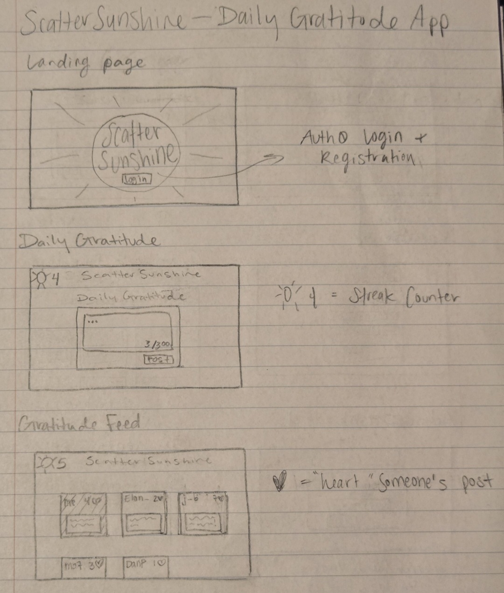

# Sunshine Gratitude

[My Notes](notes.md)

Sunshine Gratitude is a daily reflection platform inspired by the beloved hymn “There Is Sunshine in My Soul Today,” encouraging short, uplifting gratitude posts in a warm, faith-centered atmosphere. Each new post unlocks a real-time community feed with instant heart reactions, while a sun icon tracks your streak. Entries automatically expire at day’s end for a fresh start every morning, and an admin-only dashboard ensures simple, secure user management.

## 🚀 Specification Deliverable

For this deliverable I did the following. I checked the box `[x]` and added a description for things I completed.

- [x] Proper use of Markdown
- [x] A concise and compelling elevator pitch
- [x] Description of key features
- [x] Description of how you will use each technology
- [x] One or more rough sketches of your application. Images must be embedded in this file using Markdown image references.

### Elevator pitch

Sunshine Gratitude is an innovative twist on daily gratitude, blending spiritual well-being into a faith-based social network. One post each day unlocks a feed of uplifting entries, sparking real-time encouragement through heart-reacts and streak-driven consistency. Whether you’re looking to cultivate a deeper spiritual routine or find uplifting support from a like-minded community, Sunshine Gratitude is here to guide you toward a brighter, more meaningful life—one day at a time.

### Design

The following image includes design sketches for the Login, Register, Daily Gratitude post, Gratitude Feed, and Admin Dashboard flows.

### Key features

- Secure login over HTTPS
- Daily 150-character gratitude posts
- Real-time feed with heart reactions
- Sun icon for streak tracking
- Automatic expiry of daily entries
- Admin dashboard for password resets

  
### Technologies

I am going to use the required technologies in the following ways.

- **HTML** - Uses correct HTML structure for the application. Two HTML pages (a login page and a gratitude feed page). 
- **CSS** - Application styling that looks good on different screen sizes. Uses good whitespace, colour choice and contrast.
- **JavaScript** - Reactivity (e.g. What happens when a user presses a button)
- **React** - Provides registration, login, daily posting, feed display, and real-time post reactions. A separate admin route allows only admins to reset other users’ passwords.  
- **Web Service** - Backend service with endpoints for:
  - **/api/register** (user registration)    
  - **/api/login** (user authentication)  
  - **/api/gratitude** (submitting and retrieving gratitude posts)  
  - **/api/heart** (real-time reactions)  
  - **/api/admin/reset** (admin-only password reset)  
- **DB/Login** - Stores users, gratitude posts, and heart-react data in database. Register and login users. Credentials securely stored in database (password hashing). Users must be authenticated to post, view posts or react. Posts older than one day are automatically removed. 
- **WebSocket** - Broadcasts new posts and heart-reacts instantly to all connected clients for real-time feed updates.

- **HTML** – Uses correct HTML structure before porting fully to React. Two HTML pages (login and gratitude feed) with correct semantic markup (<header>, <main>, <footer>, etc.).
- **CSS** – Applies a design theme suitable for multiple screen sizes. Uses good whitespace, color choice and contrast.
- **JavaScript** – Handles user interactions (clicking “heart," submitting a gratitude post). Updates the UI in real-time through state changes and provides instant feedback.
- **React** –  Provides registration, login, daily posting, feed display, and real-time post reactions. A separate admin route allows only admins to reset other users’ passwords.
- **Web service** – Backend service with endpoints for:
  - **/api/register** (user registration)    
  - **/api/login** (user authentication)  
  - **/api/gratitude** (submitting and retrieving gratitude posts)  
  - **/api/heart** (real-time reactions)  
  - **/api/admin/reset** (admin-only password reset)  
  - External Service: Will call a public “inspirational quotes” API (from GitHub’s public-apis list) to display a daily motivational quote alongside user posts.
- **Authentication / External Service** – Users create accounts with email/password. After logging in, their username and streak progress appear on-screen, and they can post or view the feed.

Database data – A rendering of application data that is stored in the database
Stores users (with hashed passwords), gratitude posts, and heart-react counts. Automatically removes posts older than one day to refresh the feed each morning.

WebSocket data – A rendering of data that is received from your server
Broadcasts new posts and heart-reacts instantly to all connected clients, so everyone sees updates in real time without needing to refresh the page.

## 🚀 AWS deliverable

For this deliverable I did the following. I checked the box `[x]` and added a description for things I completed.

- [ ] **Server deployed and accessible with custom domain name** - [My server link](https://yourdomainnamehere.click).

## 🚀 HTML deliverable

For this deliverable I did the following. I checked the box `[x]` and added a description for things I completed.

- [ ] **HTML pages** - I did not complete this part of the deliverable.
- [ ] **Proper HTML element usage** - I did not complete this part of the deliverable.
- [ ] **Links** - I did not complete this part of the deliverable.
- [ ] **Text** - I did not complete this part of the deliverable.
- [ ] **3rd party API placeholder** - I did not complete this part of the deliverable.
- [ ] **Images** - I did not complete this part of the deliverable.
- [ ] **Login placeholder** - I did not complete this part of the deliverable.
- [ ] **DB data placeholder** - I did not complete this part of the deliverable.
- [ ] **WebSocket placeholder** - I did not complete this part of the deliverable.

## 🚀 CSS deliverable

For this deliverable I did the following. I checked the box `[x]` and added a description for things I completed.

- [ ] **Header, footer, and main content body** - I did not complete this part of the deliverable.
- [ ] **Navigation elements** - I did not complete this part of the deliverable.
- [ ] **Responsive to window resizing** - I did not complete this part of the deliverable.
- [ ] **Application elements** - I did not complete this part of the deliverable.
- [ ] **Application text content** - I did not complete this part of the deliverable.
- [ ] **Application images** - I did not complete this part of the deliverable.

## 🚀 React part 1: Routing deliverable

For this deliverable I did the following. I checked the box `[x]` and added a description for things I completed.

- [ ] **Bundled using Vite** - I did not complete this part of the deliverable.
- [ ] **Components** - I did not complete this part of the deliverable.
- [ ] **Router** - Routing between login and voting components.

## 🚀 React part 2: Reactivity

For this deliverable I did the following. I checked the box `[x]` and added a description for things I completed.

- [ ] **All functionality implemented or mocked out** - I did not complete this part of the deliverable.
- [ ] **Hooks** - I did not complete this part of the deliverable.

## 🚀 Service deliverable

For this deliverable I did the following. I checked the box `[x]` and added a description for things I completed.

- [ ] **Node.js/Express HTTP service** - I did not complete this part of the deliverable.
- [ ] **Static middleware for frontend** - I did not complete this part of the deliverable.
- [ ] **Calls to third party endpoints** - I did not complete this part of the deliverable.
- [ ] **Backend service endpoints** - I did not complete this part of the deliverable.
- [ ] **Frontend calls service endpoints** - I did not complete this part of the deliverable.

## 🚀 DB/Login deliverable

For this deliverable I did the following. I checked the box `[x]` and added a description for things I completed.

- [ ] **User registration** - I did not complete this part of the deliverable.
- [ ] **User login and logout** - I did not complete this part of the deliverable.
- [ ] **Stores data in MongoDB** - I did not complete this part of the deliverable.
- [ ] **Stores credentials in MongoDB** - I did not complete this part of the deliverable.
- [ ] **Restricts functionality based on authentication** - I did not complete this part of the deliverable.

## 🚀 WebSocket deliverable

For this deliverable I did the following. I checked the box `[x]` and added a description for things I completed.

- [ ] **Backend listens for WebSocket connection** - I did not complete this part of the deliverable.
- [ ] **Frontend makes WebSocket connection** - I did not complete this part of the deliverable.
- [ ] **Data sent over WebSocket connection** - I did not complete this part of the deliverable.
- [ ] **WebSocket data displayed** - I did not complete this part of the deliverable.
- [ ] **Application is fully functional** - I did not complete this part of the deliverable.
