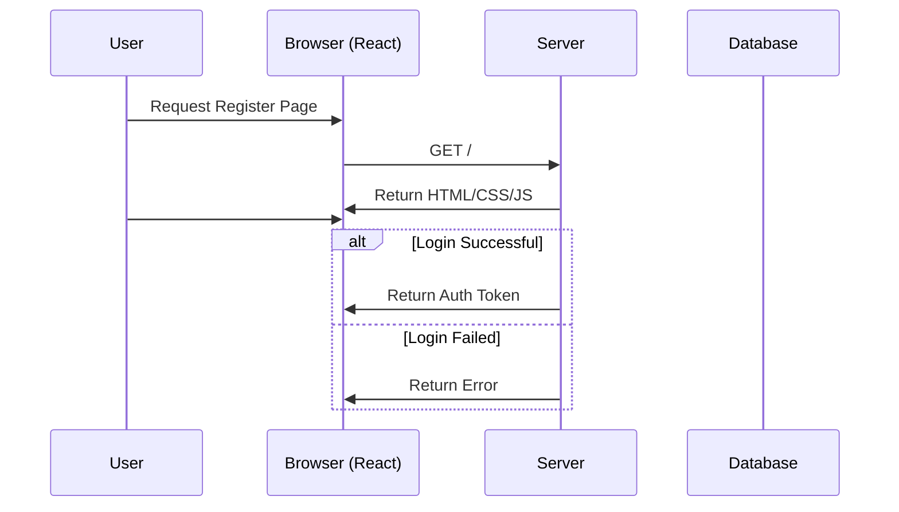

# Sunshine Gratitude

[My Notes](notes.md)

**Sunshine Gratitude** is a daily reflection platform inspired by the beloved hymn “There Is Sunshine in My Soul Today,” encouraging short (up to 150 characters), uplifting gratitude posts in a warm, faith-centered atmosphere. Each new post unlocks a real-time community feed with instant heart reactions, while a sun icon tracks your streak. Entries automatically expire at day’s end for a fresh start every morning, and an admin-only dashboard ensures simple, secure user management.

> [!NOTE]
>  This is a template for your startup application. You must modify this `README.md` file for each phase of your development. You only need to fill in the section for each deliverable when that deliverable is submitted in Canvas. Without completing the section for a deliverable, the TA will not know what to look for when grading your submission. Feel free to add additional information to each deliverable description, but make sure you at least have the list of rubric items and a description of what you did for each item.

## 🚀 Specification Deliverable
For this deliverable I did the following. I checked the box `[x]` and added a description for things I completed.

- [x] Proper use of Markdown
- [x] A concise and compelling elevator pitch
- [ ] Description of key features
- [ ] Description of how you will use each technology
- [ ] One or more rough sketches of your application. Images must be embedded in this file using Markdown image references.

### Elevator pitch

Sunshine Gratitude is an innovative twist on daily gratitude, blending spiritual well-being into a faith-based social network. One post each day unlocks a feed of uplifting entries, sparking real-time encouragement through heart-reacts and streak-driven consistency. Whether you’re looking to cultivate a deeper spiritual routine or find uplifting support from a like-minded community, Sunshine Gratitude is here to guide you toward a brighter, more meaningful life—one day at a time.

### Design

The following are two separate sequence diagrams to explain the core flows. This first diagram depicts the registration and login process as well as what results from a bad log in and an admin log in. 

This next diagram depicts the core flows of a normal user who will post and interact with the community posts. 

### Key features

- Secure login over HTTPS
- Daily 150-character gratitude posts
- Real-time feed with heart reactions
- Sun icon for streak tracking
- Automatic expiry of daily entries
- Admin dashboard for password resets

  
### Technologies

I am going to use the required technologies in the following ways.

- **HTML** - Uses correct HTML structure for the application. Two HTML pages (a login page and a gratitude feed page).
- **CSS** - Establishes consistent styling across different screen sizes. Uses good whitespace, colour choice, and contrast.  
- **React** - Provides registration, login, daily gratitude posting (<150 chars), and showing others’ posts in real-time. A separate admin page or route allows only admins to reset other users’ passwords.  
- **Service** - Backend service with endpoints for:
  - **/api/registration** (user registration)    
  - **/api/login** (user authentication)  
  - **/api/gratitude** (submitting and retrieving gratitude posts)  
  - **/api/heart** (real-time reactions)  
  - **/api/admin/reset** (admin-only password reset)  
- **DB/Login** - Stores user credentials, daily gratitude posts, and heart-react data. Includes secure password hashing. Users must be authenticated to post or react. Only admins can perform password resets. 
- **WebSocket** - Broadcasts new posts and heart-reacts instantly to all connected clients for real-time feed updates.

## 🚀 AWS deliverable

For this deliverable I did the following. I checked the box `[x]` and added a description for things I completed.

- [ ] **Server deployed and accessible with custom domain name** - [My server link](https://yourdomainnamehere.click).

## 🚀 HTML deliverable

For this deliverable I did the following. I checked the box `[x]` and added a description for things I completed.

- [ ] **HTML pages** - I did not complete this part of the deliverable.
- [ ] **Proper HTML element usage** - I did not complete this part of the deliverable.
- [ ] **Links** - I did not complete this part of the deliverable.
- [ ] **Text** - I did not complete this part of the deliverable.
- [ ] **3rd party API placeholder** - I did not complete this part of the deliverable.
- [ ] **Images** - I did not complete this part of the deliverable.
- [ ] **Login placeholder** - I did not complete this part of the deliverable.
- [ ] **DB data placeholder** - I did not complete this part of the deliverable.
- [ ] **WebSocket placeholder** - I did not complete this part of the deliverable.

## 🚀 CSS deliverable

For this deliverable I did the following. I checked the box `[x]` and added a description for things I completed.

- [ ] **Header, footer, and main content body** - I did not complete this part of the deliverable.
- [ ] **Navigation elements** - I did not complete this part of the deliverable.
- [ ] **Responsive to window resizing** - I did not complete this part of the deliverable.
- [ ] **Application elements** - I did not complete this part of the deliverable.
- [ ] **Application text content** - I did not complete this part of the deliverable.
- [ ] **Application images** - I did not complete this part of the deliverable.

## 🚀 React part 1: Routing deliverable

For this deliverable I did the following. I checked the box `[x]` and added a description for things I completed.

- [ ] **Bundled using Vite** - I did not complete this part of the deliverable.
- [ ] **Components** - I did not complete this part of the deliverable.
- [ ] **Router** - Routing between login and voting components.

## 🚀 React part 2: Reactivity

For this deliverable I did the following. I checked the box `[x]` and added a description for things I completed.

- [ ] **All functionality implemented or mocked out** - I did not complete this part of the deliverable.
- [ ] **Hooks** - I did not complete this part of the deliverable.

## 🚀 Service deliverable

For this deliverable I did the following. I checked the box `[x]` and added a description for things I completed.

- [ ] **Node.js/Express HTTP service** - I did not complete this part of the deliverable.
- [ ] **Static middleware for frontend** - I did not complete this part of the deliverable.
- [ ] **Calls to third party endpoints** - I did not complete this part of the deliverable.
- [ ] **Backend service endpoints** - I did not complete this part of the deliverable.
- [ ] **Frontend calls service endpoints** - I did not complete this part of the deliverable.

## 🚀 DB/Login deliverable

For this deliverable I did the following. I checked the box `[x]` and added a description for things I completed.

- [ ] **User registration** - I did not complete this part of the deliverable.
- [ ] **User login and logout** - I did not complete this part of the deliverable.
- [ ] **Stores data in MongoDB** - I did not complete this part of the deliverable.
- [ ] **Stores credentials in MongoDB** - I did not complete this part of the deliverable.
- [ ] **Restricts functionality based on authentication** - I did not complete this part of the deliverable.

## 🚀 WebSocket deliverable

For this deliverable I did the following. I checked the box `[x]` and added a description for things I completed.

- [ ] **Backend listens for WebSocket connection** - I did not complete this part of the deliverable.
- [ ] **Frontend makes WebSocket connection** - I did not complete this part of the deliverable.
- [ ] **Data sent over WebSocket connection** - I did not complete this part of the deliverable.
- [ ] **WebSocket data displayed** - I did not complete this part of the deliverable.
- [ ] **Application is fully functional** - I did not complete this part of the deliverable.
